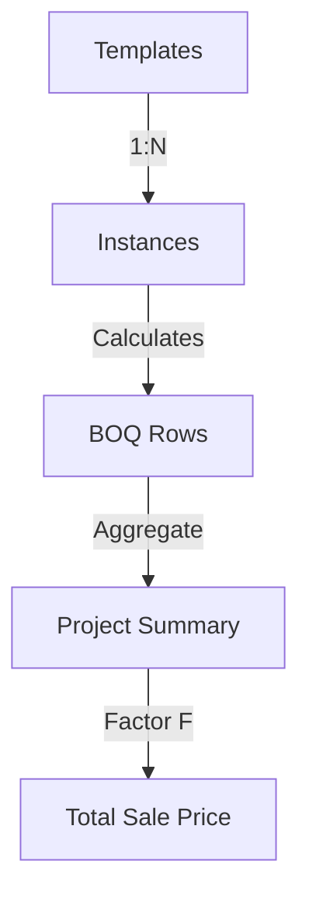

# System Architecture: Plan-First BOQ

This document outlines the technical architecture and design philosophy of the Auto-Pilot BOQ system.

## Design Philosophy: "Plan-First"
Unlike traditional BOQ software that starts with a spreadsheet, this system uses a **Plan-First approach**. The drawing canvas is the source of truth. Every line drawn is an "Instance" linked to a "Structural Template".

## Tech Stack
- **Frontend**: React + Vite
- **Styling**: Tailwind CSS (Utility-first)
- **State Management**: Zustand (`useBoqStore`) + React-Hook-Form (`form` state)
- **Drawing Engine**: Native SVG with Coordinate Transformation Matrix (CTM)
- **Data Validation**: Zod (Schema-driven architecture)
- **Visuals**: Framer Motion & Lucide Icons

## Key Modules

### 1. Drawing Engine (`LayoutCanvas.jsx`)
Uses a professional interaction model:
- **Click-Move-Click**: Two-step placement for high precision.
- **CTM Inverse**: Translates screen coordinates to a virtual meter-based grid.
- **Object Snapping**: Automatically connects nodes of different structural pieces.

### 2. Template System (`TemplateManager.jsx`)
Manages structural "standards" (e.g., B1, C1). 
- **Zonation Logic**: Supports advanced stirrup spacing (Ends vs. Middle).
- **Extra Rebar**: Handles top/bottom extra reinforcement weight calculations.

### 3. Calculation Engine (`App.jsx` + `calculator.js`)
Real-time cost estimation:
- `projectSummary`: Reactive useMemo that re-calculates all weights and costs whenever the canvas or templates change.
- **Factor F**: Implements profit, overhead, and tax markups on top of direct costs.

## Data Schema

